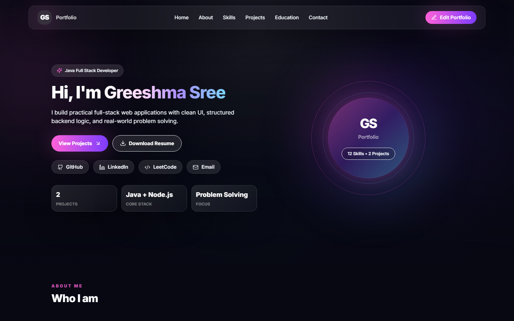
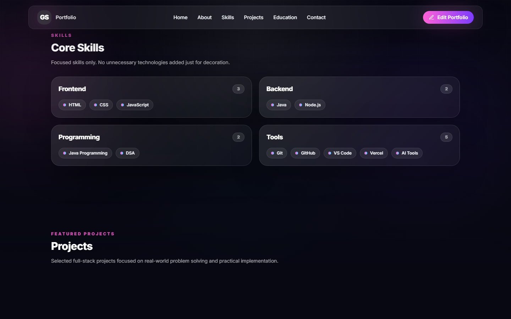
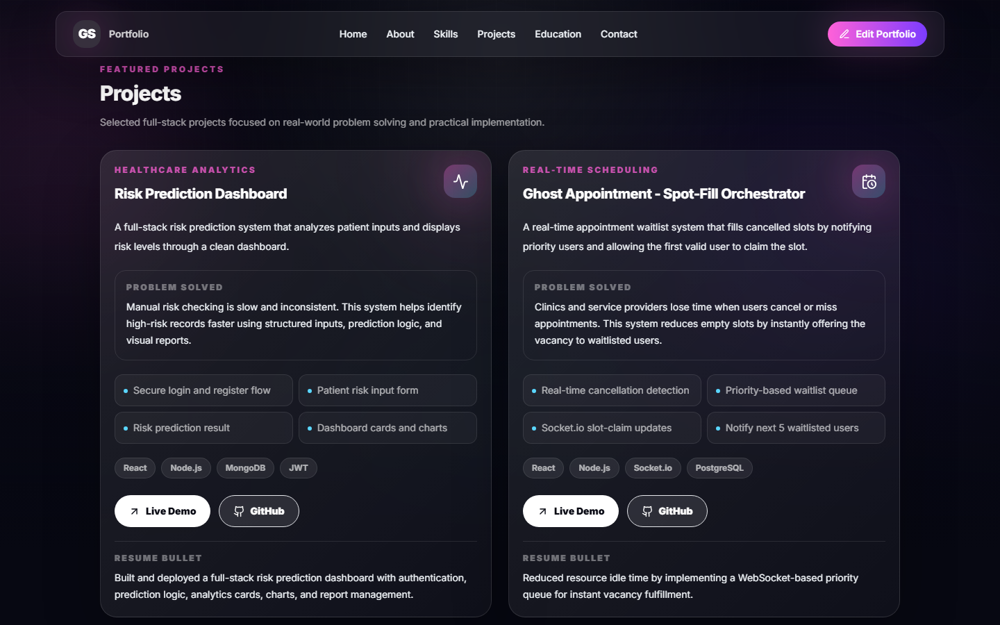
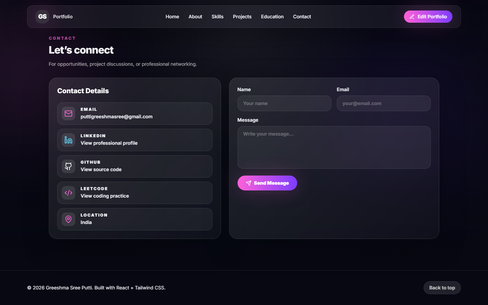

# Greeshma Sree Putti | Portfolio

Professional developer portfolio built to showcase my skills, projects, education, and contact details.

 ## Live Portfolio

🔗 Live Demo: [View Portfolio](https://my-portfolio-pied-sigma-40.vercel.app/)

## Portfolio Sections

- Home
- About
- Skills
- Projects
- Education
- Contact

## Featured Projects

### Risk Prediction Dashboard
A full-stack risk prediction system that analyzes patient inputs and displays risk levels through a clean dashboard.

Live Demo: https://safebirthai-frontend.vercel.app/  
GitHub: https://github.com/Greeshmasree76/RiskPrediction.git

### Ghost Appointment - Spot-Fill Orchestrator
A real-time appointment waitlist system that fills cancelled slots by notifying priority users and allowing the first valid user to claim the slot.

## Contact

Email: puttigreeshmasree@gmail.com  
LinkedIn: https://www.linkedin.com/in/greeshma-sree-putti-9292502bb/  
LeetCode: https://leetcode.com/u/greeshu__76/

## Screenshots

### Home

### Skills

### Projects

### Contact

